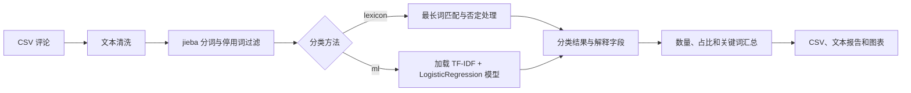

# 网络评论情感分析系统

这是一个命令行版 Python 课程项目，用于分析商品、外卖、酒店、电影、课程和数码产品评论。系统支持可解释的词典法，以及 TF-IDF + LogisticRegression 机器学习法，最终把评论分为 `positive`、`negative`、`neutral` 三类。

## 系统流程



## 主要功能

- 清洗网址、标点和多余空白。
- 使用 `jieba` 分词，支持内置和外部停用词。
- 词典法按最长词优先匹配，避免“很好”同时命中“很好”和“好”。
- 否定词只影响同一分句内、距离较近的情感词。
- 词典模式输出得分、命中词和否定反转说明。
- 机器学习模式输出预测概率和 `confidence`。
- 支持模型训练、joblib 保存和模型信息记录。
- 支持随机训练/测试划分及分层交叉验证。
- 输出准确率、macro precision、macro recall、macro F1 和混淆矩阵。

## 项目结构

```text
src/sentiment_cli/
  analyzer.py          文本处理、词典分类、关键词和图表
  data_validation.py   标注数据检查
  ml_model.py          TF-IDF + LogisticRegression
  train.py             最终模型训练与保存
  main.py              lexicon / ml 实际分析入口
  evaluate.py          holdout 与交叉验证评估
data/
  sample_comments.csv
  labeled_comments.csv
  stopwords.txt
docs/example_outputs/  固定演示结果
tests/                  pytest 测试
.github/workflows/      GitHub Actions
```

## 安装

```powershell
python -m venv .venv
.\.venv\Scripts\python.exe -m pip install -r requirements.txt
.\.venv\Scripts\python.exe -m pip install -e .
```

`joblib` 是 scikit-learn 使用的模型序列化工具，项目已在依赖中显式声明。

## 检查标注数据

```powershell
python -m sentiment_cli.data_validation `
  --input data/labeled_comments.csv `
  --column comment `
  --label label `
  --minimum-per-class 40
```

当前数据共 126 条，`positive`、`negative`、`neutral` 各 42 条。校验器会检查必要列、空文本、非法标签、原文重复、清洗后重复和类别不平衡。

## 使用词典法

原有命令仍然可用，默认方法是 `lexicon`：

```powershell
python -m sentiment_cli.main `
  --input data/sample_comments.csv `
  --column comment `
  --method lexicon `
  --stopwords data/stopwords.txt `
  --output outputs/lexicon
```

不需要图表时添加 `--no-chart`。使用 `--top-n 15` 可以调整关键词数量。不指定 `--stopwords` 时仍使用代码内置停用词。

词典模式的 `classified_comments.csv` 包含：

- `classification_method`
- `positive_score`、`negative_score`
- `positive_hits`、`negative_hits`
- `negated_hits`

多个命中词使用 `|` 连接，不会把 Python 列表直接写入单元格。

## 训练并保存模型

```powershell
python -m sentiment_cli.train `
  --input data/labeled_comments.csv `
  --column comment `
  --label label `
  --model models/sentiment_model.joblib
```

该命令使用全部合法标注数据训练用于实际推理的最终模型，并生成：

- `models/sentiment_model.joblib`：完整 sklearn Pipeline。
- `models/model_info.json`：算法、样本量、类别数量、列名、随机种子、生成时间，以及 Python 和 sklearn 版本。

训练命令负责生成最终推理模型，不把这些训练数据描述成独立测试结果。

## 使用机器学习法

```powershell
python -m sentiment_cli.main `
  --input data/sample_comments.csv `
  --column comment `
  --method ml `
  --model models/sentiment_model.joblib `
  --output outputs/ml
```

机器学习模式输出：

- `classification_method`
- `confidence`
- `positive_probability`
- `negative_probability`
- `neutral_probability`

`confidence` 是模型对本次预测给出的最大概率，不表示预测一定正确，也不能代替真实标签验证。

## 评估两种方法

```powershell
python -m sentiment_cli.evaluate `
  --input data/labeled_comments.csv `
  --column comment `
  --label label `
  --output outputs/evaluation `
  --cv-folds 5
```

评估命令保留原来的 `train_test_split`，同时使用同一组 `StratifiedKFold` 折叠比较两种方法。机器学习模型在每一折中只使用训练折训练，不会提前看到验证折。

生成文件包括：

- `evaluation_report.txt`
- `confusion_matrix.png`
- `metrics_comparison.png`

### 当前真实评估结果

以下数据来自 126 条样本、5 折分层交叉验证：

| 方法 | Accuracy | Macro Precision | Macro Recall | Macro F1 |
|---|---:|---:|---:|---:|
| 词典法平均值 | 0.9443 | 0.9466 | 0.9435 | 0.9426 |
| 词典法标准差 | 0.0544 | 0.0532 | 0.0571 | 0.0568 |
| 机器学习平均值 | 0.3643 | 0.3680 | 0.3694 | 0.3528 |
| 机器学习标准差 | 0.0576 | 0.0912 | 0.0586 | 0.0710 |

在当前数据集和评估设置下，词典法取得了更高指标。该结果依赖数据规模、数据质量、词典覆盖和折叠划分，不代表词典法在真实平台或更大数据集上必然更好，也不能说明机器学习方法一定更准确。

`accuracy` 是全部样本中预测正确的比例。`macro F1` 先分别计算每个类别的 F1，再等权平均，更适合观察模型是否兼顾三类评论。

## 固定示例结果

[`docs/example_outputs`](docs/example_outputs) 保存了一次稳定运行产生的七个演示文件。它们只用于查看结果格式，不会在每次普通运行时自动更新。实际运行结果写入被 `.gitignore` 忽略的 `outputs/`，训练模型写入 `models/`。

## 测试与 CI

```powershell
python -m pytest -q
```

GitHub Actions 在 push 和 pull request 时使用 Python 3.10 安装依赖并运行测试。CI 设置 `MPLBACKEND=Agg`，生成图表时不依赖桌面环境。

## 使用边界

这份数据是课程演示规模，来自人工整理的多领域示例，不能代表真实平台上的语言分布。词典法难以处理反讽和复杂语境；机器学习法受样本数量和特征稀疏影响明显。项目没有使用爬虫、云端情感服务、在线大模型 API 或深度学习。

本项目开发过程中使用了 AI 辅助梳理需求、编写和检查代码。课程提交时应按学校要求如实说明 AI 的参与范围，不应把 AI 生成或辅助完成的内容虚构为完全人工完成。
