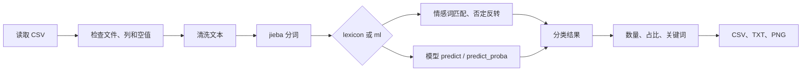

# 网络评论情感分析系统学习说明

## 1. 程序要解决的问题

程序读取 CSV 评论，把每条评论分成三类：

- `positive`：正面
- `negative`：负面
- `neutral`：中性

除了标签，程序还输出清洗文本、分词、高频关键词、分类解释、数量统计、占比图和模型评估报告。项目保持命令行结构，便于学习参数处理、文件读写、NLP 基础和机器学习评估。

## 2. 完整运行流程



训练和评估是另外两条流程：

```text
标注 CSV -> 数据校验 -> 训练全部数据 -> 保存最终推理模型
标注 CSV -> 数据校验 -> 划分训练折和验证折 -> 计算真实评估指标
```

两者不能混淆。最终模型可以使用全部合法训练数据，但它对这些训练数据的表现不能称为独立测试结果。

## 3. 文本清洗

`clean_text()` 使用正则表达式完成三件事：

1. 删除网址。
2. 把标点和其他符号替换为空格。
3. 合并连续空格，只保留中文、英文和数字。

把标点替换为空格而不是直接拼接文本还有一个作用：逗号、句号、分号、感叹号和问号会形成分句边界，否定词不会越过这个边界影响后面的情感词。

需要掌握：`re.sub()`、字符串切片、空值处理和函数返回值。

## 4. jieba 分词和停用词

中文没有天然空格，`tokenize()` 使用 `jieba.lcut()` 分词。程序先使用代码中的内置停用词，再合并可选的 `data/stopwords.txt`。

外部停用词文件规则：

- 一行一个词。
- 空行忽略。
- 以 `#` 开头的行视为注释。
- 文件不存在时给出中文错误。

命令示例：

```powershell
python -m sentiment_cli.main --input data/sample_comments.csv --stopwords data/stopwords.txt
```

高频关键词使用 `collections.Counter` 统计。停用词的目的是减少“这个”“感觉”“商品”等区分度不高的词，不是删除所有高频词。

## 5. 最长词优先匹配

旧逻辑分别遍历正面词和负面词，容易产生重叠：

```text
很好 -> 很好 + 好
很差 -> 很差 + 差
不好 -> 不好 + 好
```

现在的 `find_sentiment_matches()` 把正负词放到同一个流程中：

1. 所有词按长度从长到短排序。
2. 使用正则查找每个词的位置。
3. 用布尔列表记录已经占用的字符区间。
4. 新匹配只要与已占区间重叠，就跳过。
5. 最后按文本中的出现顺序返回命中结果。

因此，“很好”只保留一个 `很好` 命中，“不好”只保留负面词 `不好`。`很差` 和 `太差` 仍然只记录一次，但考虑到语气强度，分值高于普通的“差”。

需要掌握：集合、排序键、`re.finditer()`、字符下标、区间判断和列表。

## 6. 否定词规则

程序支持“不”“没”“没有”“不是”“无”“并不”等否定词。否定词满足两个条件才会反转情感：

1. 与情感词在同一个分句内。
2. 位于情感词前方较近的位置。

例如：

```text
不贵       贵是负面词，反转为正面
不是很好   很好是正面词，反转为负面
不，贵     逗号形成边界，不发生反转
```

词典输出会记录：

- `positive_score`、`negative_score`
- `positive_hits`、`negative_hits`
- `negated_hits`

“价格不贵，体验不错”会把“贵（否定反转）”和“不错”记录为正面命中，并在 `negated_hits` 中记录“不贵”。

这仍然是简化规则。双重否定、反讽和很长的依存关系可能需要更复杂的语言模型，本课程项目不引入这些大型依赖。

## 7. 三分类规则

`score_sentiment_text()` 先得到结构化分数，`classify_text()` 只返回最终标签：

```text
positive_score > negative_score -> positive
negative_score > positive_score -> negative
两边相同或都为 0             -> neutral
```

结构化得分与标签分开，便于测试、解释和以后替换分类入口。

## 8. 标注数据与校验

`data/labeled_comments.csv` 有 126 条评论，三类各 42 条，覆盖：

- 商品
- 外卖
- 酒店
- 电影
- 课程
- 手机和数码产品

数据包含口语、否定、转折和混合情绪，例如：

- “外观不错，但是续航太差”
- “价格不贵，不过质量比较一般”
- “说不上满意，也没有特别失望”
- “电影画面很好，但剧情比较混乱”

`data_validation.py` 检查：

- 评论列和标签列是否存在。
- CSV 是否为空。
- 评论是否为空。
- 标签是否只属于三种合法值。
- 原文是否重复。
- `clean_text()` 后是否重复。
- 每类数量是否达到要求。
- 类别是否明显不平衡。

原文不同但清洗后相同仍然属于重复，因为模型实际看到的内容基本一样。

## 9. TF-IDF 和逻辑回归

`ml_model.py` 使用 sklearn Pipeline：

```text
评论 -> jieba 分词 -> TF-IDF 向量 -> LogisticRegression -> 标签
```

TF-IDF 会提高有区分度词语的权重，降低各处都出现的普通词权重。逻辑回归学习每个特征与三种标签的关系。

需要掌握：

- `fit()` 用训练数据学习参数。
- `predict()` 输出类别。
- `predict_proba()` 输出每个类别的概率。
- Pipeline 会把预处理和分类器一起保存。

## 10. 模型保存和加载

训练命令：

```powershell
python -m sentiment_cli.train `
  --input data/labeled_comments.csv `
  --column comment `
  --label label `
  --model models/sentiment_model.joblib
```

`joblib.dump()` 保存完整 Pipeline，`joblib.load()` 负责恢复。`model_info.json` 记录算法、样本数、类别数、列名、随机种子、生成时间和版本信息，便于以后判断模型来自哪批数据和环境。

模型文件不应随意加载不可信来源，因为序列化文件可能包含不安全对象。本项目只加载自己训练生成的模型。

## 11. lexicon 和 ml 两种实际预测

词典法：

```powershell
python -m sentiment_cli.main --input data/sample_comments.csv --method lexicon --output outputs/lexicon
```

机器学习法：

```powershell
python -m sentiment_cli.main `
  --input data/sample_comments.csv `
  --method ml `
  --model models/sentiment_model.joblib `
  --output outputs/ml
```

机器学习模式检查模型路径、加载错误和非法预测标签。如果模型支持 `predict_proba()`，CSV 会记录：

- `confidence`
- `positive_probability`
- `negative_probability`
- `neutral_probability`

`confidence=0.80` 只表示模型内部给预测类别分配了 0.80 的概率，并不表示现实中一定有 80% 正确。模型可能因为数据偏差而自信地判断错误。

## 12. 随机划分与交叉验证

`evaluate.py` 保留 `train_test_split`，同时增加 `StratifiedKFold`。

分层交叉验证流程：

1. 保持每一折三类样本比例接近。
2. 生成固定的训练索引和验证索引。
3. 词典法直接预测验证折。
4. 机器学习法只在当前训练折上调用 `fit()`。
5. 在当前验证折上预测。
6. 重复所有折，计算平均值和标准差。

同一组折叠用于两种方法，比较才公平。不能先用完整数据训练模型，再回头预测所谓的验证折，那会造成数据泄漏。

## 13. 四项评估指标

`accuracy`：全部样本中预测正确的比例，直观但可能掩盖小类别问题。

`precision`：预测为某类的样本中，有多少真的属于该类。

`recall`：真实属于某类的样本中，有多少被找出来。

`F1`：precision 和 recall 的调和平均。

`macro F1`：分别计算三类 F1，再让三类拥有相同权重。即使数据不平衡，小类别也不会被大量类别完全盖住。

标准差反映不同折之间的波动。平均值高但标准差也很高，说明结果对数据划分较敏感。

## 14. 当前实际评估结果

在 126 条数据和 5 折分层交叉验证下：

| 方法 | Accuracy 均值 ± 标准差 | Macro F1 均值 ± 标准差 |
|---|---:|---:|
| 词典法 | 0.9443 ± 0.0544 | 0.9426 ± 0.0568 |
| 机器学习法 | 0.3643 ± 0.0576 | 0.3528 ± 0.0710 |

当前词典法更高，是因为人工数据中的情感表达与词典覆盖较一致，而机器学习只有 126 条多领域短文本，词级特征较稀疏。不能把这个结果外推成“词典法永远优于机器学习”，也不能为了让结果好看而伪造准确率。

## 15. 输出文件

分析命令生成：

- `classified_comments.csv`
- `summary.txt`
- `sentiment_count.png`
- `sentiment_ratio.png`

评估命令生成：

- `evaluation_report.txt`
- `confusion_matrix.png`
- `metrics_comparison.png`

`outputs/` 和 `models/` 是运行时目录，已被 Git 忽略。`docs/example_outputs/` 保存固定演示结果，便于不运行程序时查看格式。

## 16. 异常处理

三个命令行入口会把常见错误转换成简洁中文提示，包括：

- 输入文件不存在或 CSV 无法读取。
- CSV 为空、列不存在或评论全部为空。
- 标签非法。
- `top-n`、`test-size` 或 `cv-folds` 超出范围。
- 模型不存在、无法加载或输出非法标签。
- 输出目录无法创建或写入。

代码只捕获能够解释和处理的异常，不用一个很宽的 `except Exception` 隐藏真实编程错误。

## 17. 测试和 GitHub Actions

测试使用 `tmp_path` 创建临时 CSV、模型和输出，不依赖人工提前生成的 `outputs`。

```powershell
python -m pytest -q
```

GitHub Actions 在 push 和 pull request 时使用 Python 3.10 运行同一条命令。`MPLBACKEND=Agg` 保证 Linux CI 没有图形桌面时也能生成 PNG。

## 18. 建议掌握顺序

1. 看懂 `main.py` 如何解析参数和选择分类方法。
2. 掌握 `clean_text()`、`tokenize()` 和停用词。
3. 手工跟踪一次最长词匹配和字符区间占用。
4. 理解否定词为什么不能跨分句。
5. 学会用 pandas 读取、检查和保存 CSV。
6. 理解 Pipeline、TF-IDF、逻辑回归和 joblib。
7. 分清训练数据、验证数据和最终推理模型。
8. 会解释 accuracy、macro F1、混淆矩阵、均值和标准差。
9. 会运行 pytest，并根据失败位置查找问题。

## 19. 项目限制和 AI 使用说明

数据仍然只是课程演示规模，不包含真实平台的全部语言现象。词典覆盖、否定窗口和人工标签都有主观限制；机器学习结果也会受随机划分和跨领域差异影响。

本项目开发过程中使用了 AI 辅助分析需求、生成部分代码和数据草稿，并通过自动测试和实际命令检查结果。课程提交时应按学校要求如实说明 AI 的参与范围，不应伪造完全由人工独立完成的过程。
